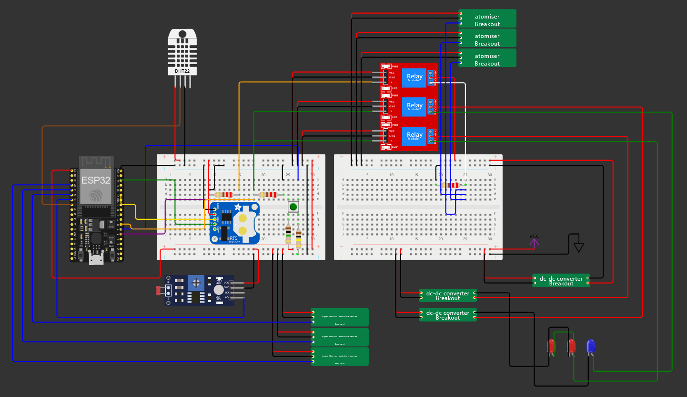

:Author: thesfinox
:Email: riccardo.finotello@gmail.com
:Date: 28/04/2024
:Revision: v3.0.0
:License: GNU General Public License v3.0

= Yet Another Hydroponics Project (YAHP)

I am quite often thoughtless when it comes to taking care of plants.
This is why I started to create something using **Arduino**.
_Yet Another Hydroponics Project_ (YAHP) is an attempt at remote controlling the status of a small greenhouse, and at providing automatic irrigation and lighting.

== Step 1: Installation

The development kit used for this project is a **ESP32 Dev Module**, and the documentation refers to that module.
However, any ESP32 board should do the trick.

In order to replicate the project, you will need to follow the circuit (sorry, no schematics for the moment) and install the files.

....
This is an IoT project: you need to provide the secrets for the connection!
....

== Step 2: Assemble the circuit

The circuit can be assembled as in the figure:

**N.B.**: in the v2, the hardware button has been removed completely from the sketch (IoT buttons are used).

=== Folder structure

....
  yahp                    => Arduino sketch folder
  ├── yahp.ino            => main Arduino file
  ├── yahp.png            => an image of the required schematics
  ├── thingProperties.png => IoT definitions
  ├── yahpProperties.png  => project definitions
  └── ReadMe.adoc         => this file
....

=== License
This project is released under a GNU General Public License v3.0.

=== Bill of Material

|===
|Part name             | Quantity        
|ESP32 Dev Module      | 1        
|RTC Module            | 1   
|Photoresistor         | 1
|Button (6 mm)         | 1
|DHT22                 | 1
|Atomisers             | 3
|Soil moisture sensors | 3
|220 Ohm resistor      | 3
|10k Ohm resistor      | 3
|100k Ohm resistor     | 1
|Relay (3.3 V)         | 3
|DC-DC converter       | 3
|3W 465 nm LED         | 4
|3W 630 nm LED         | 4
|3W 730 nm LED         | 4
|12 V 60 W DC source   | 1
|===
